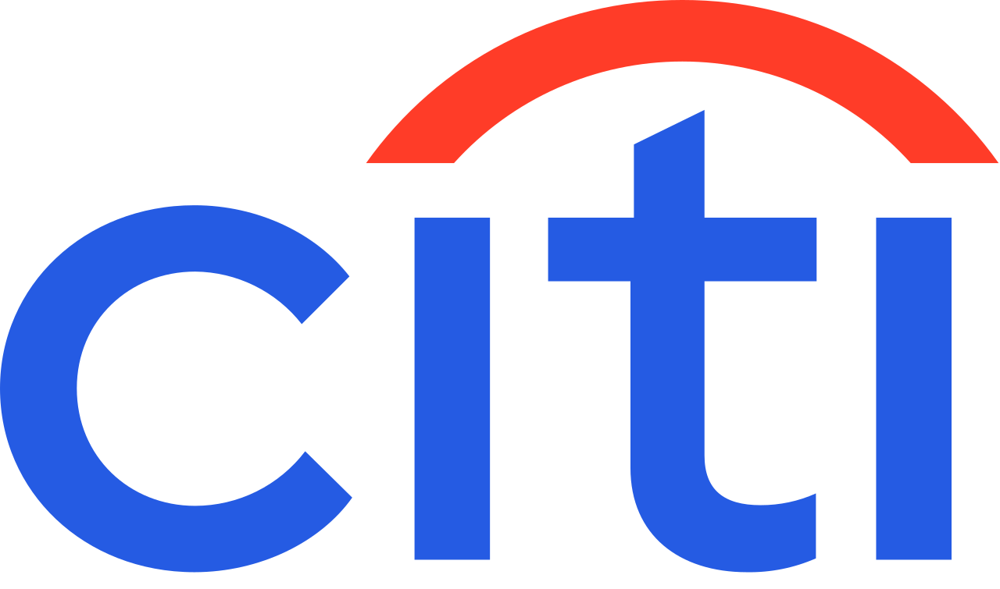

# CitiScan

**The Citi Bike app tells you how many docks are open right now. CitiScan tells you whether one will be open
when you get there.**

CitiScan predicts open docks (and bikes) at a station at your arrival time, 10 to 30 minutes from now, and
suggests nearby stations when your destination is likely to be full. Built for HackColumbia (Move Smarter track).

**Live demo: https://citiscan.vercel.app**

> CitiScan is an independent hackathon project built on Citi Bike's public data. It is not affiliated with or
> endorsed by Citi, Citi Bike or Lyft.

**The headline:** trust the current count and the station is full when you arrive about 1 in 20 times. Go where
CitiScan says *likely* and it's about 1 in 53: **62% fewer surprise full stations** (95,160 predictions on real
September dock counts, 15 minutes ahead).

Why it matters: on a Saturday at 1pm, 208 of 2,442 stations were completely full and 555 had two or fewer open
docks. On a weekday morning a Midtown station like E 47 St & Park Ave gains about 44 bikes in the 7am hour alone.

## How it works

1. **Live state.** Citi Bike's public [GBFS feed](https://gbfs.lyft.com/gbfs/2.3/bkn/gbfs.json) gives open
   docks and bikes at every station, updated every minute.
2. **Historical flows.** From 16 million trips (June to August 2026) we compute, for every station, day type
   (weekday / Saturday / Sunday) and 15-minute slot of the day:
   - the average **net inflow** (bikes arriving minus bikes leaving), smoothed with the neighbouring slots
   - the **day-to-day variance** of that net inflow

   Days a station had no trips at all (not open yet, or closed) are skipped, and each slot is clipped to its
   5th-95th percentile so one-off events (Summer Streets closed Park Ave on August Saturdays) don't dominate.
3. **Prediction.**
   `open docks at arrival = open docks now - expected net inflow between now and arrival`,
   clamped between 0 and the station's size. The expected inflow is the historical flow scaled by 0.8 on
   weekdays and 0.35 on weekends: real dock counts move less than trips imply, because Citi Bike rebalances
   with trucks and valets, and summer weekends are busier than autumn ones (fit on real September dock counts,
   see below). Expected changes under half a bike count as "no change".
4. **Confidence.** We treat the change as roughly normal, with that mean and the historical variance, and
   compute the chance that at least one dock is free: **likely** (80%+), **maybe** (50-80%), **unlikely** (<50%).
5. **Validation.** `backtest.py` replays logged snapshots of the live feed, predicts 5 to 30 minutes ahead with
   exactly the app's math (checked: identical output for all 2,442 stations), and compares with what happened.

## How well it works

### On real dock counts

Two sources of ground truth, both after our June-August training data: **Brooklyn**, a public archive of
5-minute snapshots of 195 Williamsburg/Greenpoint stations, September 1-26 (weekdays and weekends, including
rush hours), and **our own log** of all 2,442 stations, every minute, from Saturday afternoon to Sunday morning,
September 26-27 (weekend only, with gaps while the laptop slept). Numbers are for arriving 15 minutes from now. The app's "How accurate is this?" panel shows them.

| | Brooklyn, Sep 1-26 | All NYC, our log |
|---|---|---|
| Station full on arrival when the current count showed open docks | 4.9% | 1.6% |
| Station full on arrival when we said **likely** | **1.9%** | **0.4%** |
| Stations that filled up before you arrived that we warned about (maybe/unlikely) | 67% of 4,184 | 75% of 2,227 |
| We said **unlikely** but a dock was open | 0.4% | 0.0% |
| Probability score (Brier, lower is better): ours vs trusting the current count | 0.059 vs 0.085 (**31% better**) | 0.026 vs 0.030 (14% better) |

When we said *likely*, a dock was open 98% of the time; *maybe*, 73%; *unlikely*, 40% (Brooklyn). The
current count can't warn you at all: it only knows about now.

What we learned, honestly:

- **Exact counts 15 minutes out are mostly noise.** Our predicted open-dock counts beat "the count stays the
  same" by only 1-5% (5% in weekday rush hours at 30 minutes). The main edge is knowing *how volatile* each
  station is at each time of day, which drives the labels. A version with the same volatility but no expected
  flow scores about the same probability score; the flow adds a little on weekday commutes.
- **Trip flows overstate real dock changes**: about 0.8x on weekdays and 0.35x on weekends. We fit those factors
  on Brooklyn September 1-15 and checked them on September 16-25 and our own log.
- **Things that didn't help**: last September's trips (worse than this summer's; the network and e-bike use
  changed more than the season), the last 10 minutes of observed change, day-of-week instead of
  weekday/Saturday/Sunday.

### On held-out trip data

Trained on June 1 to August 17 and tested on the next two weeks. Error is the average number of bikes the
predicted change is off by; the naive baseline always predicts no change. This measures trip flows only
(no rebalancing), so it's an upper bound on what flows can add.

| Horizon | Where | Naive error | Our error | Improvement |
|---|---|---|---|---|
| 15 min | all stations, 6am-10pm | 0.82 | 0.80 | 3% |
| 15 min | busiest 10% of stations, weekday rush hours | 2.93 | 2.53 | 14% |
| 30 min | all stations, 6am-10pm | 1.28 | 1.21 | 6% |
| 30 min | busiest 10% of stations, weekday rush hours | 4.78 | 3.75 | 22% |

The actual change landed inside our 80% range 82% of the time at 15 minutes and 80% at 30 minutes.

### Known limitations

- **Rebalancing and valet service aren't in the trip data.** At 40 stations (e.g. Dock 72 Way & Market St: 22
  docks, ~34 net arrivals per hour on weekday mornings) the flows are bigger than the station could hold, so
  Citi Bike must be moving bikes. The app flags these stations.
- Our weekday validation is Brooklyn only; Midtown's valet stations are the least certain.
- 64 stations have no trips in our window (new or not installed). We fall back to the current count.

## Using the app

- **Map**: every station, colored by the chance of an open dock (or a bike, with the toggle) when you arrive:
  blue *likely*, amber *maybe*, red *likely full*. The colors pass a colorblind check across every pair, and
  riskier stations are drawn bigger so color is never the only cue.
- **Plan a trip**: search a station name or an address (or tap the map) for where you're going. Set a start
  point (your location, or tap the map) and the arrival time comes from the distance and real riding speeds:
  12.3 km/h straight-line on an e-bike, 9.4 km/h on a classic bike, measured from member trips. Without a start
  point, use the "arriving in" slider.
- **The next 30 minutes**: the station card charts the chance of a dock minute by minute, with your arrival marked,
  and says it plainly ("Likely full by 9:06 AM, about 21 min from now"). It also shows how many of the bikes are
  e-bikes, since 73% of rides are on e-bikes.
- **Backups**: if the destination isn't "likely", we list up to 3 stations within 1 km where a dock is likely,
  closest first, with the walking time to your destination (4.8 km/h, 1.3x the straight-line distance).
- **How accurate is this?** opens the backtest results: the headline, warnings and false alarms, and how often
  each label came true, for both test sets.
- Stations that aren't accepting bikes right now, have no trip history, or where Citi Bike moves bikes by truck
  or valet are called out on the card. On a phone, "Hide" shrinks the panel to one line.

### Demo modes

- **What if…**: pick weekday / Saturday / Sunday and a time (say, a weekday at 8:45am). Predictions use that
  time's flows on today's live counts, and a slider sets how many docks the destination has open right now.
  The "Try" link loads E 47 St & Park Ave with 6 open docks.
- **Replay**: real moments from the logs, e.g. Williamsburg on Friday September 18 at 9:25pm, when 24 stations
  that had open docks were full 15 minutes later (we flagged 18). The app shows what it would have predicted,
  a scorecard, and what actually happened at each station; a toggle recolors the map by the real outcome.
  `pipeline/make_replays.py` picks the moments where the most stations filled up (skipping feed glitches) and
  reports our hit rate on them as-is. Replays carry their own station data, so they keep working if Citi Bike's
  live feed goes down; the app then offers one instead of showing an empty map.

API: `GET /api/predict?minutes=15` (or `?at=<ISO time>`) returns every station with its live counts, expected
change, predicted docks and bikes, and the chance of each. Demo options: `&now=<ISO>` (flows for another time),
`&override=<station_id>:<docks>`, `&replay=<id>` (from `GET /api/replays`). `GET /api/timeline?station=<station_id>`
takes the same options and returns that station's chance of a dock and a bike for each of the next 30 minutes
(plus the logged counts, for replays). Set `GBFS_FEED` to a dead URL to try the app with the live feed down.

## Two-minute demo script

1. **The problem (live map).** Open https://citiscan.vercel.app. "Every dot is a Citi Bike station. The app you
   know shows docks right now; red means CitiScan expects it to be full by the time you get there."
2. **A real trip.** Search a station, tap "Pick on map" and drop a start point. "It works out the ride time from
   real trip speeds and predicts the dock count at arrival. If it's not a safe bet, it lists backups nearby."
3. **Rush hour (What if…).** Click "Try: Midtown office block, 6 open docks". "Weekday 8:45am, E 47 St & Park Ave
   shows 6 open docks. Bikes pour in at that hour, so CitiScan says *maybe*, about 2 docks left, and lists
   backup stations a few minutes' walk away."
4. **Proof (Replay).** Pick "Williamsburg area, Fri Sep 18, 9:25pm". "These are real counts from that night. 24
   stations with open docks were full 15 minutes later; we flagged 18 of them in advance." Tick "Color the map
   by what actually happened" and tap a red station to show "✓ we called it".
5. **The number.** Open "How accurate is this?": "62% fewer surprise full stations, tested on 95,000
   predictions against real dock counts the model never saw."

## Running it

Requirements: Python 3.10+ with `pip install -r pipeline/requirements.txt`, Node 20+.

```bash
# 1. download trip data (about 1 GB per month; the zips are read directly, no need to unzip)
cd data/raw
for m in 202606 202607 202608; do
  curl -O https://s3.amazonaws.com/tripdata/$m-citibike-tripdata.zip
  curl -O https://s3.amazonaws.com/tripdata/JC-$m-citibike-tripdata.csv.zip
done
cd ../..

# 2. build the lookup table -> web/data/flow_table.json (about 90s the first time, cached after)
python3 pipeline/build_flow_table.py

# 3. log live snapshots for the backtest. Leave it running; on macOS use `caffeinate -i` and keep the laptop
#    plugged in with the lid open (a closed lid sleeps the Mac and pauses logging).
python3 pipeline/snapshot_logger.py

# 3b. backtest against the logs and the Brooklyn archive -> web/data/backtest.json
#     (Brooklyn archive: download data/raw/*.csv.gz from github.com/smturzo/citibike-williamsburg
#      into data/external/williamsburg/)
python3 pipeline/backtest.py

# 3c. pick replay moments for the demo -> web/data/replays.json
python3 pipeline/make_replays.py

# 4. run the web app -> http://localhost:3000
cd web && npm install && npm run dev

# 5. deploy: pushes to main deploy automatically (the Vercel project's Root Directory is web/).
#    To deploy by hand, run this from the repo root after `npx vercel login` once:
npx vercel deploy --prod
```

## Project layout

```
pipeline/
  build_flow_table.py   trips -> per-station expected net flow table (web/data/flow_table.json)
  snapshot_logger.py    saves the live station_status feed every minute (data/snapshots/)
  backtest.py           replays the logs: our predictions vs what happened vs the current count
  make_replays.py       picks real past moments for the app's replay mode (web/data/replays.json)
web/
  app/api/predict/      live feed + flow table -> predictions for every station (+ what-if / replay)
  app/api/replays/      the replay moments available
  lib/predict.ts        the prediction math (mirrored in the Python backtest)
  lib/scenario.ts       which moment and whose counts (live, what-if, replay) for both API routes
  lib/accuracy.ts       backtest results -> the "How accurate is this?" panel
  app/components/       map (Leaflet), search, trip card, demo controls, accuracy panel
  data/                 flow_table.json, backtest.json, replays.json (outputs of the pipeline)
data/                   raw downloads, logs, caches (not committed)
```

## Data sources

- **Citi Bike GBFS feed**: https://gbfs.lyft.com/gbfs/2.3/bkn/gbfs.json (`station_information`, `station_status`)
- **Citi Bike trip data**: https://citibikenyc.com/system-data, monthly files from https://s3.amazonaws.com/tripdata/.
  Trip station ids match the GBFS `short_name` field (not `station_id`).
- **Brooklyn snapshot archive** (extra weekday validation data):
  [smturzo/citibike-williamsburg](https://github.com/smturzo/citibike-williamsburg), 5-minute snapshots of 195
  stations, August 26 to September 26, 2026
- **Map**: © [OpenStreetMap](https://www.openstreetmap.org/copyright) contributors; addresses via OpenStreetMap
  Nominatim.

Citi Bike data is provided by Lyft under the
[Citi Bike Data License Agreement](https://citibikenyc.com/data-sharing-policy).
